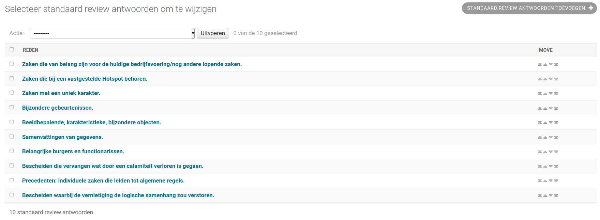

.. _configuration:

=============
Configuration
=============

Quickstart
==========

This is the minimal configuration and assumes you loaded in the default roles
described in the :ref:`defaults`. You can also define your own roles as
described in the :ref:`more-configuration`.

Services
--------

The ArchiefBeheerComponent must be connected to an instance of Open Zaak.

1. Navigate to the ArchiefBeheerComponent admin.

2. Configure the credentials for the Zaken API (so the
   ArchiefBeheerComponent can access the Zaken API):

   a. Navigate to **API Autorisaties > Services**
   b. Click **Service toevoegen**.
   c. Fill out the form:

      - **Label**: ``Open Zaak - Zaken API``
      - **Type**: Select the option: ``ZRC (Zaken)``
      - **API root url**: *For example:* ``http://example.com/zaken/api/v1/``

      - **Client ID**: *For example:* ``avc-demo``
      - **Secret**: *Some random string. You will need this later on!*
      - **Authorization type**: Select the option: ``ZGW client_id + secret``
      - **OAS**: URL that points to the OAS, same URL as the *API root url* with ``/schema/openapi.yaml`` added to it
        *for example:* ``https://example.com/api/v1/schema/openapi.yaml``
      - **User ID**: *Same as the Client ID*
      - **User representation**: *For example:* ``ArchiefBeheerComponent``

   d. Click **Opslaan**.

3. Repeat the steps above for the **Catalogi API**  and the **Documenten API**.
   Make sure to use the same Client ID and Secret for each of them.

   For the **Catalogi API**, also fill in **Extra configuration** with:

   .. code-block:: json

      {"main_catalogus_uuid": "<the UUID of your main catalog>"}

4. Add the Selectielijst API:

   a. Navigate to **API Autorisaties > Services**
   b. Click **Service toevoegen**.
   c. Fill out the form:

      - **Label**: ``Open Zaak (public) - Selectielijst API``
      - **Type**: Select the option: ``ORC (Overige)``
      - **API root url**: ``https://selectielijst.openzaak.nl/api/v1/``

      - **Authorization type**: Select the option: ``No authorization``
      - **OAS**: ``https://selectielijst.openzaak.nl/api/v1/schema/openapi.yaml``

   d. Click **Opslaan**.

Open Zaak
---------

1. Navigate to the Open Zaak admin.

2. Configure the credentials for the ArchiefBeheerComponent (so the
   ArchiefBeheerComponent can access the various Open Zaak APIs):

   a. Navigate to **API Autorisaties > Applicaties**
   b. Click **Applicatie toevoegen**.
   c. Fill out the form:

      - **Label**: ``ArchiefBeheerComponent``
      - **Heeft alle autorisaties**: *Checked*

      - **Client ID**: *The same as configured in the ArchiefBeheerComponent.*
      - **Secret**: *The same as configured in the ArchiefBeheerComponent.*

   d. Click **Opslaan**.

.. _more-configuration:

More configuration
==================

.. note:: This part of the configuration documentation is aimed at (functional)
   administrators.

The ArchiefBeheerComponent supports run-time configuration for maximum flexibility to make it fit your
environment. This does also mean that a fresh installation is empty and not useful
without any configuration.

The configuration interface is available on ``https://example.com/admin/``, where
``example.com`` should be replaced by your actual domain.

.. _configuraton_permissions:

Accounts, roles and permissions
===============================

Permissions
-----------

The ArchiefBeheerComponent has a simple permission system, consisting of the following permissions:

**can start destruction**

  Someone who can start destruction is allowed to create destruction lists. A person
  with this permission will see a list of their own destruction lists on their landing
  page, and a button to create a new list.

**can review destruction**

  Someone with this permission can be assigned as a reviewer for a destruction list.
  On their landing page, they see an overview of all the destruction lists where they
  were once assigned as a reviewer. They can suggest changes/exemptions on destruction
  lists back to the destruction list author.

**can view case details**

  Someone with this permission is allowed to view more details about a case. This could
  be part of the review process or destruction list creation process.

.. _Roles configuration:

Roles
-----

Navigate to **Authenticatie en authorisatie > Rollen** to manage roles. Roles
define a set of permissions. An application user can have one role.

Typical example roles would be:

- **record manager**:
    - *can start destruction*: yes
    - *can review destruction*: no
    - *can view case details*: yes

- **process owner**:
    - *can start destruction*: no
    - *can review destruction*: yes
    - *can view case details*: yes

- **archivist**:
    - *can start destruction*: no
    - *can review destruction*: yes
    - *can view case details*: no

You can create as many roles as you want and name them as you see fit.

There is a fixture to load default roles.

    .. tabs::

        .. group-tab:: Docker

           .. code:: shell

              $ docker-compose exec web src/manage.py loaddata default_roles

        .. group-tab:: Python

          .. code:: shell

              $ source env/bin/activate
              $ python src/manage.py loaddata default_roles

This adds 4 :ref:`roles` in the application: process owner, archivist, record
manager and functional administrator.
Process owner, archivist and record manager are described :ref:`here <roles>`,
while the functional administrator is a role with all the permissions of the
three roles above combined.

Accounts
--------

Via **Authenticatie en authorisatie > Gebruikers** you can manage individual users
known to the system. You can perform administrative actions such as:

- assigning a role to a user
- filling out their name/e-mail address
- (re)setting their password

ADFS
----

The ArchiefBeheerComponent admin interface and frontend support logging in through ADFS-backed single sign
on (SSO).

ADFS 2012 and 2016, and Azure AD are supported. See the `ADFS config guides`_ for
documentation on how to configure ADFS itself.

The ADFS configuration can be found under **Admin > Configuration > ADFS Configuration**.

.. _`ADFS config guides`: https://django-auth-adfs.readthedocs.io/en/latest/config_guides.html

Services
========

The ArchiefBeheerComponent does not store, synchronize or copy case data. All data is retrieved through the
Zaken, Catalogi and Documenten API. As such, these services need to be configured.

Navigate to **Configuratie > Services** and add the details for your
environment.

.. note:: ArchiefBeheerComponent supports multiple services of the same type.

Catalogi API
------------

The ArchiefBeheerComponent uses the Catalogi API to provide filter options based on "zaaktype".

Add a service of the type ``ZTC``, and make sure to fill out:

- ``API root URL``: the API base URL of the service.
- ``Extra configuration``: a JSON object with the main catalogue ID, e.g.:

  .. code-block:: json

    {"main_catalogus_uuid": "09a4ae7a-98a3-4178-9559-b22b76cad3db"}

- ``Client ID``: the client ID for your "application" that was registered with the
  Catalogi API-serving application.
- ``Secret``: the Secret for your "application" that was registered with the
  Catalogi API-serving application.
- ``Authorization type``: ZGW-client_id + secret
- ``OAS``: URL to the API schema, normally this is ``API root URL`` + ``schema/openapi.yaml``.
- ``NLX url``: optional NLX outway-URL if the service is to be consumed over the NLX
  network.

Zaken API
---------

The Zaken API is used to retrieve the zaken matching the archiving terms. They are the
objects that are eventually destroyed by this application.

Add a service of the type ``ZRC``. The configuration steps for the Catalogi API apply
here, with the exception of "Extra configuration" - this is not required.

Documenten API
--------------

Cases ("zaken") almost always have relations to documents. If the case is being
destroyed, documents related to it (and no other cases) also need to be destroyed. For
that purpose, the ArchiefBeheerComponent needs access to the Documents API.

Add a service of the type ``DRC``. The configuration steps for the Catalogi API apply
here, with the exception of "Extra configuration" - this is not required.

Selectielijst API
-----------------

The steps to configure a service to a Selectielijst API are the same as those for the Documenten API, except that
the type of service is ``ORC``.

**Why is the Selectielijst API needed?**

When a list is destroyed, a report of destruction is generated with references to all the cases that
were destroyed. This report contains the following fields:

1. Unieke kenmerk: the ``identificatie`` field of a case
2. Beschrijving: the ``omschrijving`` field of a case
3. Looptijd: the number of days between the ``enddatum`` and ``startdatum`` field of a zaak.
4. Vernietigings-Categorie selectielijst: the ``nummer`` field of the ``selectielijstProcestype`` of the ``zaaktype``.
5. Toelichting: the name of the destruction list
6. Opmerkingen: the comment in the latest approval review from the archivaris (user with a role with permissions to review the destruction, but not to start the destruction or view case details).
7. Reactie zorgdrager: the comment in the latest approval review from the process eigenaar (user with a role with permissions to review the destruction and review case details, but not to start the destruction).

In order to retrieve the data for point 4., a service to a Selectielijst API needs to be configured. Otherwise this
field will be left empty in the report.

Required scopes
---------------

The Catalogi, Zaken and Documenten API enforce authorization checks. For the correct
functioning of the ArchiefBeheerComponent, it needs the following scopes:

**Zaken API**

  - ``zaken.lezen``: used to display detail information
  - ``zaken.geforceerd-bijwerken``: used to change archiving parameters for exemptions
  - ``zaken.verwijderen``: used to destroy selected cases

**Catalogi API**

  - ``catalogi.lezen``: used to fetch available case-types

**Documenten API**

  - ``documenten.lezen``: used to display case detail information
  - ``documenten.verwijderen``: used to destroy documents as part of the case destruction

**Besluiten API**

  - ``besluiten.lezen``: used to display case detail information
  - ``besluiten.verwijderen``: used to delete "besluiten" as part of the case destruction

Archive configuration
=====================

The ArchiefBeheerComponent only offers cases of which the archive action date has passed, to prevent
destruction of cases before their scheduled archiving. This is annoying for testing
purposes, so the ArchiefBeheerComponent supports specifying the "current date".

Navigate to **Configuratie > Archiveringsconfiguratie** to specify the
"current date".

In the archive configuration it is possible to set the number of days after which a reviewer assigned to a list
should receive an email reminder.
For the email to be sent, a template also needs to be configured (see :ref:`Automatic emails`).

.. _optional destruction case settings:

Optional destruction case settings
----------------------------------

In the bottom section of the **Configuratie > Archiveringsconfiguratie** page, it is possible to configure
whether a case should be created in Open-Zaak once a destruction list is processed
(i.e. all the cases have been deleted). If this feature is enabled, the following things will be created in Open-Zaak:

- A zaak of the configured zaaktype
- An enkelvoudiginformatieobject of configured informatieobjecttype from the destruction report
- A zaakinformatieobject relating the created zaak and the enkelvoudiginformatieobject
- A status of the configured statustype
- A resultaat of the configured resultaattype

In order to turn this feature on, the checkbox "create zaak" should be ticked.
The RSIN of the bronorganisatie should be configured, as well as an URL for the desired zaaktype,
informatieobjecttype, statustype and resultaattype.

When this feature is NOT turned on, the destruction report can be downloaded from the application.
If this feature IS turned on, it is possible to disable downloading the destruction report from the application. To do
this, the checkbox "Destruction report downloadable" should be ticked.

Theme settings
==============

You can easily change the colors, logo and footer texts to match the ones from
your organizaton.

Navigate to **Configuration > Thema configuratie** to configure the theme.

Setting the domain
==================

In the admin, under **Configuratie > Websites**, make sure to change the existing `Site` to the domain under which
the ArchiefBeheerComponent will be deployed.

.. _Automatic emails:

Automatic emails
================

The system administrator can decide to configure automatic emails to be sent to the reviewers and/or the
record manager. This can be done through the admin, under **Configuratie > Automatische emails**

If there are already automatic emails present, they can be edited. There are four types of automatic emails:

- Review required: for when a reviewer has a destruction list to review.
- Changes required: for when a record manager needs to process the feedback form a reviewer.
- Report available: for when a destruction report is sent to the archivist.
- Review reminder: for when a reviewer waits too long before reviewing a list and needs a reminder.

A custom email subject and email body can be configured for each type of email. If no automatic emails are present
in the admin in **Configuratie > Automatische emails**, then no emails will be sent.

To load default automatic emails, a fixture is present. This can be loaded with the following command (from the
``archiefbeheercomponent/`` directory):

    .. tabs::

        .. group-tab:: Docker

           .. code:: shell

              $ docker-compose exec web src/manage.py loaddata default_emails

        .. group-tab:: Python

          .. code:: shell

              $ source env/bin/activate
              $ python src/manage.py loaddata default_emails

A few variables can be used in the email body. These are:

- ``{{ user}}``: it will be replaced with the full name (first name and last name) of the user receiving the email.
- ``{{ municipality }}``: it will be replaced with the name of the municipality sending the email.
- ``{{ list }}``: it will be replaced with the name of the destruction list.
- ``{{ link_list }}``: it will be replaced with the link to the destruction list.
- ``{{ link_report }}``: it will be replaced with the link to where the PDF of the destruction report can be downloaded.

.. note:: In order to use the variable ``{{ municipality }}``, the municipality name needs to be configured under **Configuratie > Email configuratie**.

.. note:: The variable ``{{ link_report }}`` can only be used in the email of type "Report available".

.. _Standard review answers:

Standard review answers
=======================

When a reviewer asks for changes to a destruction list, they can choose from a drop down the reason why
they are asking for changes. These reasons can be configured in the admin under
**Reviews > Standard review aantwoorden** and then **Standard review aantwoorden toevoegen**.
Both the text and the order in which these reasons will appear in the dropdown can be configured.
Once you have added multiple reasons in the admin, you can use the up and down arrows on the right
(see screenshot below) to change the order.

To load in default reasons, the fixture `default_review_answers` can be loaded as follows:

    .. tabs::

        .. group-tab:: Docker

           .. code:: shell

              $ docker-compose exec web src/manage.py loaddata default_review_answers

        .. group-tab:: Python

          .. code:: shell

              $ source env/bin/activate
              $ python src/manage.py loaddata default_review_answers

This feature will load the following reasons (in this order):

- Zaken die van belang zijn voor de huidige bedrijfsvoering/nog andere lopende zaken.
- Zaken die bij een vastgestelde Hotspot behoren.
- Zaken met een uniek karakter.
- Bijzondere gebeurtenissen.
- Beeldbepalende, karakteristieke, bijzondere objecten.
- Samenvattingen van gegevens.
- Belangrijke burgers en functionarissen.
- Bescheiden die vervangen wat door een calamiteit verloren is gegaan.
- Precedenten: individuele zaken die leiden tot algemene regels.
- Bescheiden waarbij de vernietiging de logische samenhang zou verstoren.

Audit trails
============

In version ``1.0``, the templates used for the audit trail have been renamed. Their extension was changed from
``.txt`` to ``.html``. A management command was added to change the template name in all existing logs.
This can be executed as follows:

    .. tabs::

        .. group-tab:: Docker

           .. code:: shell

              $ docker-compose exec web src/manage.py convert_log_templates

        .. group-tab:: Python

          .. code:: shell

              $ source env/bin/activate
              $ python src/manage.py convert_log_templates
