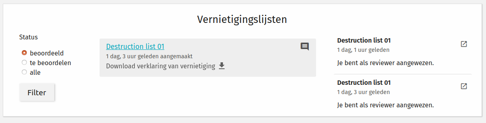

.. _destruction:

===================
Destruction process
===================

The destruction process takes care of destroying the case data, with respect to their
archiving law parameters.

As part of "zaakgericht werken" ("case management"), the archive parameters are
determined during the life-cycle of a case. There are two possible actions:

- destroy cases
- keep cases (and transfer them to an e-depot)

Each case has an "archive action date", which is the date after which the determined
action needs to be performed.

The derivation of these parameters is part of the standard for
"API's voor Zaakgericht Werken". The Archiefvernietigingscomponent provides the tooling to perform the destruction
of the cases past the archive action date.

.. note:: When we mention destruction, we mean permanent destruction. The API calls made
   to the involved API's cause the data to be erased from the database and documents to
   be removed from the file systems.

The next sections document the process as implemented in the Archiefvernietigingscomponent.

Destruction list creation
=========================

A user with sufficient permissions (see :ref:`configuraton_permissions`) can bring up
the destruction list creation screen.

Filters are provided on the left hand side, while the main content shows a table of
cases matching the filter criteria. Only the cases that have their archive action date
before or on the current date are available.

Filters
-------

The filters allow you to select a sub-set of cases based on case-type. Each case type
displays the various versions, so you can limit the selection to a specific version.

You can also filter on start date - only cases started before or on the selected date
are retrieved.

Case selection
--------------

The destruction list author adds cases to the destruction list by checking the checkbox.
The checkbox in the table heading can be used to toggle *all* cases matching the
provided filters.

In the top-right, a summary of the amount of selected cases is displayed.

Finalizing the list creation
----------------------------

Once all relevant cases have been selected, the list author can now finalize the list
creation by clicking the top-right button, which brings up a form.

The form requires you to give the list a name for identification purposes, and you
specify which users should be involved in the review process. The reviewers should be
selected in order of review.

Available users are selected based on their role permission.

There is also a checkbox which can be used to specify whether the destruction list contains cases
with sensitive information. If the checkbox is checked (default), the report of destruction will
*NOT* contain the case description and the remarks of the archivist.

Once the confirmation button is clicked, the list is created and assigned to the first
reviewer.

Destruction list review
=======================

Each reviewer assigned to a list performs the review in turn after the previous reviewer
has approved the destruction list.

Each reviewer has the option to suggest exemptions or changes:

- exemptions: suggests removing the case from the destruction list
- changes: the reviewer can provide a comment so that the author knows which changes to
  make to the archiving parameters. The case will also be removed from the list

Once a reviewer suggests changes or exemptions, the original list author is assigned,
where they process the changes. After processing the changes, the review flow restarts
with the first reviewer.

If the author of the destruction list disagrees with changes suggested in a review,
they can add a comment before submitting the list for further review. Only the reviewer
who created the controversial review will be able to see the comment.

After the last reviewer has given their approval, the list is submitted for actual
destruction to the background worker queue.

After destruction
-----------------

Once a list has been destroyed, a report of destruction is created. The report contains the following information:

    - Uniek kenmerk
    - Beschrijving *
    - Loop tijd
    - VCS
    - Toelichting
    - Opmerkingen *
    - Reactie Zorgdrager
    - Zaaktype
    - Bewaartermijn
    - Resultaattype
    - Verantwoordelijke organisatie
    - Relaties

The fields with asterisk are optional. They are only present if the record manager unchecked the checkbox
``Contains sensitive details`` when they created the destruction list.

The destruction report is an HTML file with the information mentioned above for each case that was destroyed.
The report is sent via email to the archivist who reviewed the list and the process owner can
download the report within the AVC app. The link can be found in the page with path ``vernietigen/reviews/`` after
filtering for lists that have already been reviewed. All lists with an associated report will have a link
(see image below).

Audit trails and logs
=====================

Destruction list assignees receive notifications when important events happen, such as
being the next assignee on the list.

Additionally, audit trails are collected for list creation, review submission and case
deletion (for every individual case!).

Deleting a list
===============

Should the author decide to cancel the destruction process for a list of cases,
they can use the 'abort' button in the top right hand corner of the list details page.
Clicking this button will cancel only the list, i.e. the cases will *NOT* be destroyed.
The cases that were part of the cancelled list will become available again to be included
in other destruction lists.
