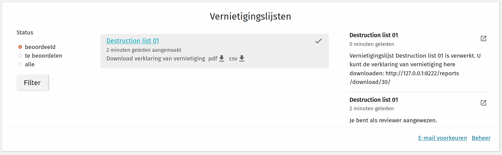

.. _destruction:

============================
Destruction process overview
============================

The destruction process takes care of destroying the case data, with respect to their
archiving law parameters.

As part of "zaakgericht werken" ("case management"), the archive parameters are
determined during the life-cycle of a case. There are two possible actions:

- destroy cases
- keep cases (and transfer them to an e-depot)

Each case has an "archive action date", which is the date after which the determined
action needs to be performed.

The derivation of these parameters is part of the standard for
"API's voor Zaakgericht Werken". The Archiefvernietigingscomponent provides the tooling to perform the destruction
of the cases past the archive action date.

.. note:: When we mention destruction, we mean permanent destruction. The API calls made
   to the involved API's cause the data to be erased from the database and documents to
   be removed from the file systems.

The next sections document the process as implemented in the Archiefvernietigingscomponent.

Destruction list creation
=========================

A user with sufficient permissions (see :ref:`configuraton_permissions`) can bring up
the destruction list creation screen.

Filters are provided on the left hand side, while the main content shows a table of
cases matching the filter criteria. Only the cases that have their archive action date
before or on the current date are available.

It is possible to update the archiving details of a case by clicking on it. This will bring the user to a
form where the ``archiefnominatie``, ``archiefactiedatum`` and the ``archiefstatus`` of a case can be updated.
Upon submission, the case will be changed in the configured Open Zaak instance.

Filters
-------

The filters allow you to select a sub-set of cases based on case-type. Each case type
displays the various versions, so you can limit the selection to a specific version.

You can also filter on start date - only cases started before or on the selected date
are retrieved.

Case selection
--------------

The destruction list author adds cases to the destruction list by checking the checkbox.
The checkbox in the table heading can be used to toggle *all* cases matching the
provided filters.

In the top-right, a summary of the amount of selected cases is displayed.

Finalizing the list creation
----------------------------

Once all relevant cases have been selected, the list author can now finalize the list
creation by clicking the top-right button, which brings up a form.

The form requires you to give the list a name for identification purposes, and you
specify which users should be involved in the review process. The reviewers should be
selected in order of review.

Available users are selected based on their role permission.

There is also a checkbox which can be used to specify whether the destruction list contains cases
with sensitive information. If the checkbox is checked (default), the report of destruction will
*NOT* contain the case description and the remarks of the archivist.

Once the confirmation button is clicked, the list is created and assigned to the first
reviewer.

Lists overview
--------------

In the start page, the record manager has an overview of all the lists that they created.
To facilitate searching through the lists, there are filters on the left-hand side:

- In progress (*In behandeling*): lists that are waiting to be reviewed and lists that have been approved, but are waiting to be processed.
- Action required (*Actie vereist*): lists that have been reviewed, but not approved. The reviewer may either have asked for changes or rejected them.
- Completed (*Verwerkt*): lists that have been processed and the cases have been deleted.
- All (*Alle*): All lists.

Destruction list review
=======================

Each reviewer assigned to a list performs the review in turn after the previous reviewer
has approved the destruction list.

Reviewers with *process owner* role have the option to suggest exemptions or changes:

- exemptions: suggests removing the case from the destruction list
- changes: the reviewer can provide a comment so that the author knows which changes to
  make to the archiving parameters. The case will also be removed from the list

Once a reviewer suggests changes or exemptions, the original list author is assigned,
where they process the changes. After processing the changes, the review flow restarts
with the first reviewer.

If the author of the destruction list disagrees with changes suggested in a review,
they can add a comment before submitting the list for further review. Only the reviewer
who created the controversial review will be able to see the comment.

Reviewers with *archivist* role do NOT have the option to suggest changes or exemptions,
but they can reject a list in its entirety. After an archivist has rejected a list, the
original list author is assigned. The author can then decide whether to abort the list and start a new one,
make changes to the existing list, or simply add a comment for the archivist explaining why they
disagree with their review.

After the last reviewer has given their approval, the list is submitted for actual
destruction to the background worker queue.

Reminders
---------

If a reviewer is assigned to review a list, but doesn't do so within a certain period of time (which can be configured),
they will be sent an email reminder. To facilitate the task of the record manager to keep track of lists that remain
in progress for too long, any list for which a reminder has been sent is highlighted in the homepage.

After destruction
-----------------

Once a list has been destroyed, a report of destruction is created. The report contains the following information:

    - Uniek kenmerk
    - Beschrijving *
    - Loop tijd
    - VCS
    - Toelichting
    - Opmerkingen *
    - Reactie Zorgdrager
    - Zaaktype
    - Bewaartermijn
    - Resultaattype
    - Verantwoordelijke organisatie
    - Relaties

The fields with asterisk are optional. They are only present if the record manager unchecked the checkbox
``Contains sensitive details`` when they created the destruction list.

The destruction report is generated both as a PDF and a CSV file. It contains the information mentioned above
for each case that was destroyed.
The link to the report is sent via email to the archivist who reviewed the list and the process owner can
download the report within the AVC app. The link can be found in the page with path ``vernietigen/reviews/`` after
filtering for lists that have already been reviewed. All lists with an associated report will have a link
(see image below).

In addition, the PDF of the destruction report contains the audit trail of the destruction process.
It shows in chronological order which actions have been performed and the role of the user who performed
the action.

Audit trails, logs and notifications
====================================

Audit trails are collected for list creation, review submission and case
deletion (for every individual case!).

In addition, destruction list assignees receive notifications within the app
when important events happen, such as being the next assignee on the list or when a
destruction report is ready.

If configured, automatic emails can also be sent to notify the reviewers
and/or the record manager when there is work that needs their attention. There are four
types of automatic emails that can be configured:

- An email for the reviewer for when a destruction list needs to be reviewed.
- An email for the record manager for when there are changes requested by a reviewer.
- An email for the archivist with as attachment a report of destruction.
- An email that will be sent as a reminder to any reviewer that wait too long before reviewing a list.

Each user can also update their email preferences. They can decide whether to receive an
email as soon as there is work waiting for them or to never receive emails. The link to the
page where email preferences can be changed is at the bottom right of the entry view.

Deleting a list
===============

Should the author decide to cancel the destruction process for a list of cases,
they can use the 'abort' button in the top right hand corner of the list details page.
Clicking this button will cancel only the list, i.e. the cases will *NOT* be destroyed.
The cases that were part of the cancelled list will become available again to be included
in other destruction lists.

Cases without archiefactiedatum
===============================

From the main page, the record manager can click on the button 'Cases without archive date' to
view a list of all cases without an ``archiefactiedatum``. The table shows cases ordered by case type,
and it is also possible to filter the cases by case type.

For convenience, there is also a search field for case identification.

It is possible to change the archiving details of a case by clicking on it.

